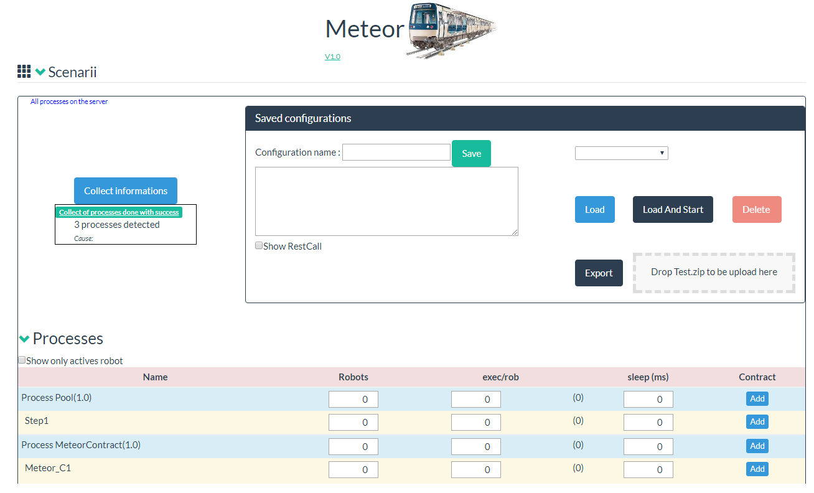
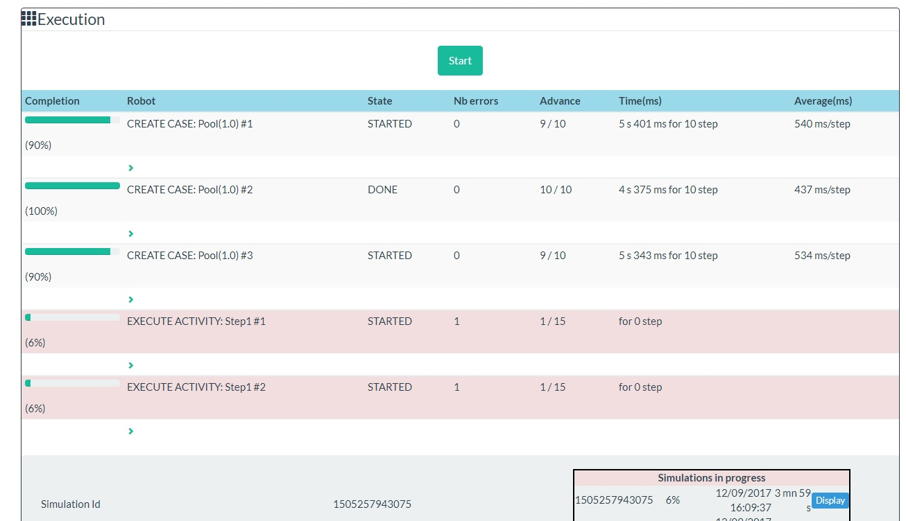

# page_meteor

Automatic test on your processes. Different method is available to simumlate and load processes: by example, or via some scenario. Tests can be run automaticaly by some REST API call (Continious Integration isage)

Describe the scenarii to test (per process, or per grovvy scenarion)
 

Run the test : track the advancement and the result
 

